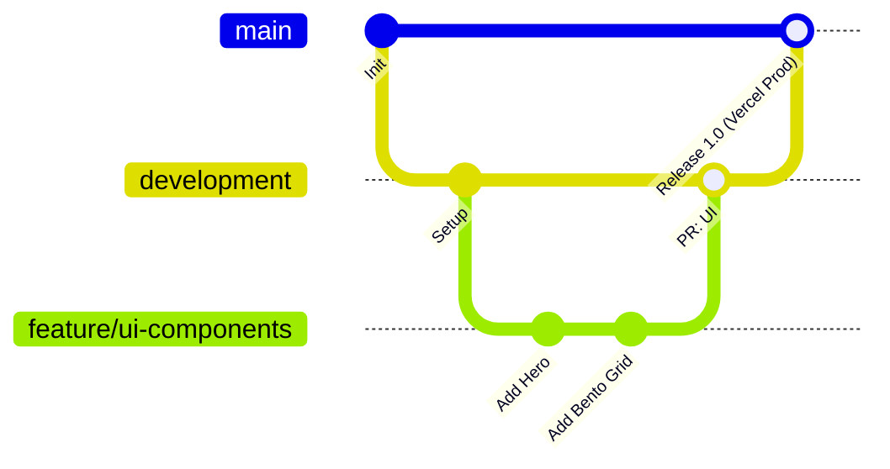
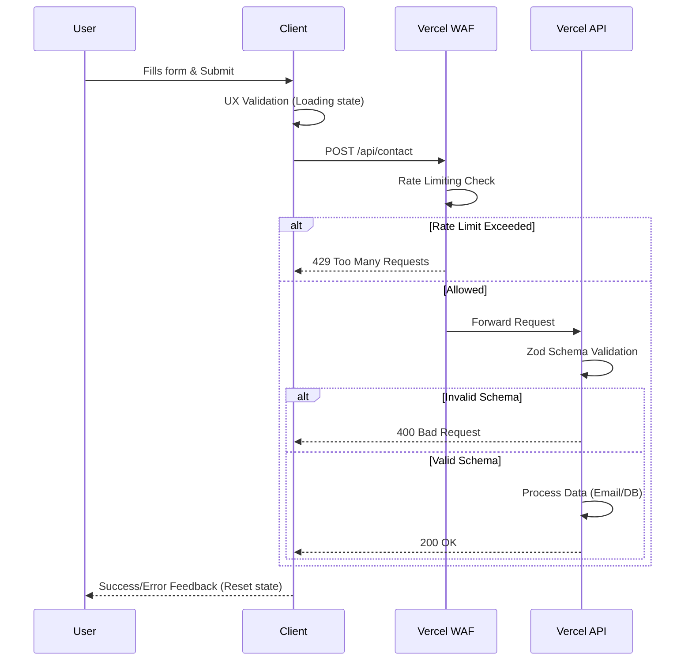

# PROJECT ARCHITECTURE & GOVERNANCE

## 1. Top Skills & IA Guidelines
- **Token-Saving:** Code & responses are concise, modular, and dense in context.
- **Visual Architecture:** Mermaid diagrams required for data flows, CI/CD, and logic.

## 2. Git & CI/CD Strategy
- `main`: Production (100% stable).
- `development`: Integration & local testing.
- `feature/*`: Short-lived branches from/to `development`.
- **Vercel:** Auto-preview deployments on PRs for security audits.

## 3. UI/UX & Tech Stack
- **Framework:** Vite (React SPA).
- **Data & i18n:** Local JSON, multi-language (EN/ES) con toggle accesible.
- **Design:** Figma + v0.dev.
- **Stack:** Tailwind CSS, Shadcn UI, Framer Motion.
- **Theme:** Dark/Light modes con textos de alto contraste.
  - *Palette:* bg `#0B0F19`, text `#F3F4F6`, accent `#38BDF8`, muted `#94A3B8`
  - *Fonts:* `Geist Sans`/`Inter` & `Geist Mono`/`JetBrains Mono`
- **Structure:**
  1. Hero Section (Value + CTA).
  2. Bento Grid (Projects: Problem, Tech, Results) + Carrusel de Imágenes (5-9).
  3. Tech Stack (Icons).
  4. About/Philosophy.
  5. Footer & Contact Form.

## 4. Security (Data Layer)
- **Client (UX):** Visual validation, error/loading states (prevent double submit).
- **Server (Vercel API):**
  - Schema Validation (Zod) for XSS/Injection mitigation.
  - Rate Limiting (Vercel WAF) for spam/DoS mitigation.

## 5. MANUAL CRUD CLI (Persistencia de Conocimiento)

### 🌿 CRUD de Branches (Git)
* **Create & Switch:** `git checkout -b feature/nombre-caracteristica`
* **Read (List):** `git branch -a`
* **Update (Push):** `git push -u origin feature/nombre-caracteristica`
* **Delete:** `git branch -d feature/nombre-caracteristica` (Remoto: `git push origin --delete feature/nombre-caracteristica`)

### 📋 CRUD de Issues (GitHub CLI)
* **Create:** `gh issue create --title "Título" --body "Descripción"`
* **Read (List):** `gh issue list` (Detalle: `gh issue view <número>`)
* **Update (Comment):** `gh issue comment <número> --body "Mensaje"`
* **Delete (Close):** `gh issue close <número>`

### 🔀 CRUD de Pull Requests (GitHub CLI)
* **Create:** `gh pr create --title "Título" --body "Descripción" --base main`
* **Read (List):** `gh pr list` (Estado checks Vercel: `gh pr status`)
* **Update:** `git add . && git commit -m "msg" && git push`
* **Delete (Close):** `gh pr close <número_PR>`

### 🤝 Operaciones de Merge Eficientes
* **Merge Local (Manual):** `git checkout main && git pull origin main && git merge <rama>`
* **Merge Seguro desde CLI (Squash & Clean):** `gh pr merge <número_PR> --squash --delete-branch`

## 6. ENTORNO DE DESARROLLO (WSL + PNPM)
- **Host:** WSL (Debian Linux). Uso exclusivo de rutas nativas (`/home/Debian/...`).
- **Package Manager:** `pnpm` (Uso estricto, prohibido `npm`/`npx`).
- **Ejecución CLI:** 
  - Comandos temporales: `pnpm dlx <paquete>`
  - Servidor: `pnpm dev`
- **Seguridad y CI:** Congelamiento de versiones obligatorio con `pnpm install --frozen-lockfile` para evitar desajustes con Vercel.
