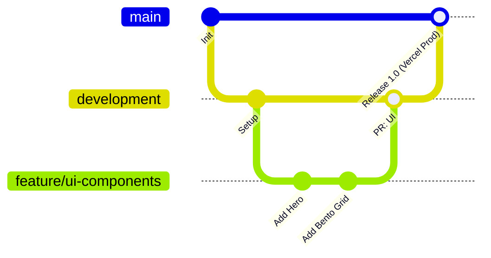
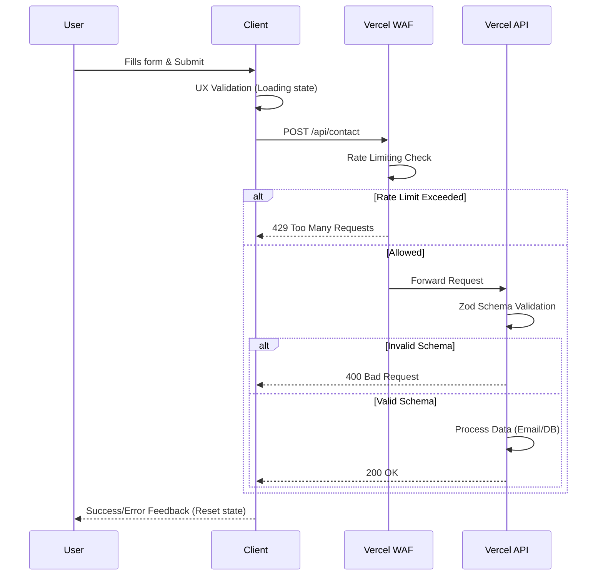

# PROJECT ARCHITECTURE & GOVERNANCE

## 1. Top Skills & IA Guidelines
- **Token-Saving:** Code & responses are concise, modular, and dense in context.
- **Visual Architecture:** Mermaid diagrams required for data flows, CI/CD, and logic.

## 2. Git & CI/CD Strategy
- `main`: Production (100% stable).
- `development`: Integration & local testing.
- `feature/*`: Short-lived branches from/to `development`.
- **Vercel:** Auto-preview deployments on PRs for security audits.

## 3. UI/UX & Tech Stack
- **Design:** Figma + v0.dev.
- **Stack:** Tailwind CSS, Shadcn UI, Dark/Light modes.
- **Structure:**
  1. Hero Section (Value + CTA).
  2. Bento Grid (Projects: Problem, Tech, Results).
  3. Tech Stack (Icons).
  4. About/Philosophy.
  5. Footer & Contact Form.

## 4. Security (Data Layer)
- **Client (UX):** Visual validation, error/loading states (prevent double submit).
- **Server (Vercel API):**
  - Schema Validation (Zod) for XSS/Injection mitigation.
  - Rate Limiting (Vercel WAF) for spam/DoS mitigation.

